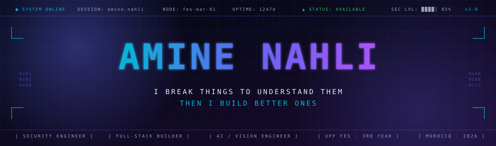

<!--
═══════════════════════════════════════════════════════════════════════════════
  AMINE NAHLI — GITHUB PROFILE README · v3.0
  ─────────────────────────────────────────
  Theme:  Security Operations Center / Mission Dashboard
  Stack:  Markdown + Custom SVG + GitHub Stats APIs
═══════════════════════════════════════════════════════════════════════════════

  SETUP INSTRUCTIONS:
  1. Upload  banner.svg  to:  .github/assets/banner.svg  in your profile repo
     (the file is provided alongside this README)
  2. Or use the capsule-render fallback by uncommenting the line below the banner.
  3. Commit & push — everything else renders automatically from public APIs.
-->

<!-- ════════════════════════ HERO BANNER ════════════════════════ -->

<a href="https://github.com/Amine-NAHLI">
  
</a>

<!-- Fallback (uncomment + delete line above if you haven't uploaded banner.svg):

-->

<!-- ════════════════════════ STATUS STRIP ════════════════════════ -->

<div align="center">

<kbd>**◉ LIVE**</kbd> &nbsp;
<kbd>📍 Fès, Morocco</kbd> &nbsp;
<kbd>🎓 UPF · 3rd Year Eng.</kbd> &nbsp;
<kbd>🟢 Available 2026</kbd> &nbsp;
<kbd>🌐 AR · FR · EN</kbd>

<br/><br/>

[](https://linkedin.com/in/amine-nahli-48b2a734b)
[](mailto:nahli-ami@upf.ac.ma)
[](https://github.com/Amine-NAHLI)
[](https://github.com/Amine-NAHLI)

</div>

<br/>

<!-- ════════════════════════ MISSION BRIEF ════════════════════════ -->

<table align="center" border="0">
<tr>
<td width="80" align="center" valign="top">

```
┌──┐
│01│
└──┘
```

</td>
<td valign="top">

### `MISSION_BRIEF.md`

I'm a third-year engineering student turning curiosity into shipped code. Half my brain runs `nmap`, the other half writes Laravel migrations. I've shipped **16 projects** spanning offensive security, full-stack platforms, computer vision, and robotics — because each one answered a question I had.

I don't believe security and product are different jobs. They're two sides of the same craft: **understanding systems deeply enough to build ones that hold.**

</td>
</tr>
</table>

<br/>

<!-- ════════════════════════ CONTROL PANEL ════════════════════════ -->

<div align="center">

### ⎯⎯⎯⎯⎯⎯⎯⎯⎯⎯⎯  CONTROL PANEL  ⎯⎯⎯⎯⎯⎯⎯⎯⎯⎯⎯

</div>

<table>
<tr>
<td width="33%" valign="top" align="center">

<br/>


#### `00` &nbsp; OFFENSIVE SECURITY

<sub>Recon · Pentesting · CVE Research</sub>

<br/>

`Kali` `Python` `Bash`<br/>
`Nmap` `Wireshark` `Linux`

<br/>


<sub>I think in packets.<br/>I read CVEs like others read news.</sub>

</td>
<td width="33%" valign="top" align="center">

<br/>


#### `01` &nbsp; FULL-STACK ENG.

<sub>APIs · Auth · Architecture</sub>

<br/>

`Laravel` `Spring Boot`<br/>
`PHP` `Node` `Angular`<br/>
`MySQL` `MongoDB` `Tailwind`

<br/>


<sub>Clean code, clean APIs,<br/>RBAC done right the first time.</sub>

</td>
<td width="33%" valign="top" align="center">

<br/>


#### `02` &nbsp; AI &middot; VISION

<sub>Real-time CV · Robotics · ML</sub>

<br/>

`OpenCV` `YOLOv8`<br/>
`MediaPipe` `Python`<br/>
`Java` `React Native`

<br/>


<sub>Where math, cameras,<br/>and servomotors meet.</sub>

</td>
</tr>
</table>

<br/>

<!-- ════════════════════════ PROJECT VAULT ════════════════════════ -->

<div align="center">

### ⎯⎯⎯⎯⎯⎯⎯⎯⎯⎯⎯  PROJECT VAULT  ⎯⎯⎯⎯⎯⎯⎯⎯⎯⎯⎯

**16 repositories** · **4 mission types** · *every commit tells a story*

<br/>

| | MISSION | COUNT | STACK | STATUS |
|:---:|:---|:---:|:---|:---:|
| 🔴 | **Offensive Tooling** | 4 | `python` `kali` `ml` | 🟢 active |
| 🔵 | **Full-Stack Platforms** | 6 | `laravel` `spring` `node` | 🟢 active |
| 🟣 | **AI · Vision · Robotics** | 4 | `yolo` `opencv` | 🟢 active |
| 🟠 | **Experiments** | 2 | `python` `web` | 🟡 evolving |

</div>

<br/>

---

#### <kbd>&nbsp;🔴 &nbsp;MISSION 01 &nbsp;</kbd>&nbsp;&nbsp;Offensive Security Tooling

<table>
<tr>
<td width="50%" valign="top">

<br/>

### 🕵️ &nbsp;[smart-network-mapper](https://github.com/Amine-NAHLI/smart-network-mapper)

> Network scanner with an **AI vulnerability-detection layer**. Maps live hosts, ports, services across subnets — outputs structured visual reports.

<br/>

`python` &nbsp;·&nbsp; `nmap` &nbsp;·&nbsp; `ai` &nbsp;·&nbsp; `MIT`

<sub>**Why I built it:** existing scanners stop at "port 22 open." I wanted one that says "port 22 open, here's what could go wrong."</sub>

</td>
<td width="50%" valign="top">

<br/>

### 🔍 &nbsp;[port-scanner-python](https://github.com/Amine-NAHLI/port-scanner-python)

> TCP/UDP port scanner built **from raw sockets**. Real-time progress, banner grabbing, export. Zero Nmap dependency — by design.

<br/>

`python` &nbsp;·&nbsp; `raw-sockets` &nbsp;·&nbsp; `cli`

<sub>**Why I built it:** to actually understand what `nmap -sS` does under the hood. Reading docs ≠ writing your own.</sub>

</td>
</tr>
<tr>
<td width="50%" valign="top">

<br/>

### 🧬 &nbsp;[cve-dataset-generator](https://github.com/Amine-NAHLI/cve-dataset-generator)

> Pulls live data from the **NVD API** and structures it into ML-ready datasets for vulnerability detection models.

<br/>

`python` &nbsp;·&nbsp; `nvd-api` &nbsp;·&nbsp; `ml`

<sub>**Why I built it:** to feed the ML layer of `smart-network-mapper`. Tools compound.</sub>

</td>
<td width="50%" valign="top">

<br/>

### 🔐 &nbsp;`security-portfolio` &nbsp;<kbd>PRIVATE</kbd>

> Personal research vault — **CTF writeups**, custom tooling, pentest notes, vulnerability research. Curated, not published.

<br/>

`python` &nbsp;·&nbsp; `bash` &nbsp;·&nbsp; `research`

<sub>🔒 Available on request to recruiters and verified collaborators.</sub>

</td>
</tr>
</table>

---

#### <kbd>&nbsp;🔵 &nbsp;MISSION 02 &nbsp;</kbd>&nbsp;&nbsp;Full-Stack Platforms

<table>
<tr>
<td width="50%" valign="top">

<br/>

### 🏥 &nbsp;[hopital-app](https://github.com/Amine-NAHLI/hopital-app)

> Full hospital management system — patients, doctors, appointments, medical records — with **role-based access control**.

<br/>

`laravel` &nbsp;·&nbsp; `blade` &nbsp;·&nbsp; `mysql`

</td>
<td width="50%" valign="top">

<br/>

### 📦 &nbsp;[gestion-stock-commerce](https://github.com/Amine-NAHLI/gestion-stock-commerce)

> Stock & commerce platform for SMBs — inventory, orders, suppliers. **Spring Boot REST API + Angular SPA**.

<br/>

`spring-boot` &nbsp;·&nbsp; `angular` &nbsp;·&nbsp; `MIT`

</td>
</tr>
<tr>
<td width="50%" valign="top">

<br/>

### 🎓 &nbsp;[gestion-etudiants-PHP](https://github.com/Amine-NAHLI/gestion-etudiants-PHP) &nbsp;⭐

> Student management — registration, grades, modules, admin dashboard. **Pure PHP, zero framework**, by choice.

<br/>

`php` &nbsp;·&nbsp; `mysql` &nbsp;·&nbsp; `vanilla`

</td>
<td width="50%" valign="top">

<br/>

### 🛍️ &nbsp;[look-me](https://github.com/Amine-NAHLI/look-me)

> Modern fashion **e-commerce** — catalog, cart, auth, checkout flow. Sleek UX, lean stack.

<br/>

`javascript` &nbsp;·&nbsp; `e-commerce`

</td>
</tr>
<tr>
<td width="50%" valign="top">

<br/>

### 🗺️ &nbsp;[geoalert](https://github.com/Amine-NAHLI/geoalert) &nbsp;⭐

> **Real-time road incident reporting** — drivers signal accidents on a live Leaflet map. Crowdsourced safety, lightweight stack.

<br/>

`node` &nbsp;·&nbsp; `express` &nbsp;·&nbsp; `mongo` &nbsp;·&nbsp; `leaflet`

</td>
<td width="50%" valign="top">

<br/>

### 🍜 &nbsp;[recette-du-monde](https://github.com/Amine-NAHLI/recette-du-monde-avec-API-mobile-expo)

> Mobile app — browse world cuisines, search dishes, save favourites. **React Native Expo + Recipe API**.

<br/>

`react-native` &nbsp;·&nbsp; `expo` &nbsp;·&nbsp; `rest-api`

</td>
</tr>
</table>

---

#### <kbd>&nbsp;🟣 &nbsp;MISSION 03 &nbsp;</kbd>&nbsp;&nbsp;AI · Vision · Robotics

<table>
<tr>
<td width="50%" valign="top">

<br/>

### ✋ &nbsp;[real-time-detection-hand](https://github.com/Amine-NAHLI/real-time-detection-hand)

> Webcam → 21 hand landmarks → gesture recognition. Live, smooth, accurate. **MediaPipe + OpenCV**.

<br/>

`python` &nbsp;·&nbsp; `opencv` &nbsp;·&nbsp; `mediapipe` &nbsp;·&nbsp; `MIT`

</td>
<td width="50%" valign="top">

<br/>

### 🚗 &nbsp;[transport-yolo-robot](https://github.com/Amine-NAHLI/transport-yolo-robot)

> Autonomous robot using **YOLOv8** — detects & avoids obstacles in real-time from a live camera feed.

<br/>

`python` &nbsp;·&nbsp; `yolov8` &nbsp;·&nbsp; `robotics`

</td>
</tr>
<tr>
<td width="50%" valign="top">

<br/>

### 📐 &nbsp;[transport-optimizer-ro](https://github.com/Amine-NAHLI/transport-optimizer-ro)

> Operations Research route optimizer — **Dijkstra, Bellman-Ford, linear programming**. Math meets logistics.

<br/>

`python` &nbsp;·&nbsp; `algorithms` &nbsp;·&nbsp; `OR`

</td>
<td width="50%" valign="top">

<br/>

### 🤖 &nbsp;[robotech-presentation](https://github.com/Amine-NAHLI/robotech-presentation)

> Animated web showcase for a robotics project — interactive demos, technical docs, smooth UX.

<br/>

`javascript` &nbsp;·&nbsp; `html5` &nbsp;·&nbsp; `css3`

</td>
</tr>
</table>

---

#### <kbd>&nbsp;🟠 &nbsp;MISSION 04 &nbsp;</kbd>&nbsp;&nbsp;Experiments

<table>
<tr>
<td width="50%" valign="top">

<br/>

### 🏰 &nbsp;`donjon_game_version1` &nbsp;<kbd>PRIVATE</kbd>

> **Dungeon adventure game** in Python — turn-based combat, inventory system, procedural rooms, enemy AI. v1 in active dev.

<br/>

`python` &nbsp;·&nbsp; `game-dev` &nbsp;·&nbsp; `cli`

<sub>🔒 Private — actively developing</sub>

</td>
<td width="50%" valign="top" align="center">

<br/><br/>

### 🔧 &nbsp;More incoming…

<sub>*Side projects spawn faster than I polish READMEs.*</sub>

<br/>

[](https://github.com/Amine-NAHLI)

</td>
</tr>
</table>

<br/>

<!-- ════════════════════════ TELEMETRY ════════════════════════ -->

<div align="center">

### ⎯⎯⎯⎯⎯⎯⎯⎯⎯⎯⎯  TELEMETRY  ⎯⎯⎯⎯⎯⎯⎯⎯⎯⎯⎯

<sub>real-time GitHub metrics · auto-refreshed</sub>

<br/><br/>

<table>
<tr>
<td>

</td>
<td>

</td>
</tr>
</table>

<br/>


<br/><br/>


<br/><br/>


</div>

<br/>

<!-- ════════════════════════ TECH ARSENAL ════════════════════════ -->

<div align="center">

### ⎯⎯⎯⎯⎯⎯⎯⎯⎯⎯⎯  TECH ARSENAL  ⎯⎯⎯⎯⎯⎯⎯⎯⎯⎯⎯

<br/>

<table>
<tr>
<td align="center" width="120"><br/><sub>Python</sub></td>
<td align="center" width="120"><br/><sub>Kali</sub></td>
<td align="center" width="120"><br/><sub>Linux</sub></td>
<td align="center" width="120"><br/><sub>Bash</sub></td>
<td align="center" width="120"><br/><sub>Laravel</sub></td>
<td align="center" width="120"><br/><sub>Spring</sub></td>
<td align="center" width="120"><br/><sub>PHP</sub></td>
</tr>
<tr>
<td align="center"><br/><sub>Node.js</sub></td>
<td align="center"><br/><sub>JavaScript</sub></td>
<td align="center"><br/><sub>Java</sub></td>
<td align="center"><br/><sub>Angular</sub></td>
<td align="center"><br/><sub>React Native</sub></td>
<td align="center"><br/><sub>Tailwind</sub></td>
<td align="center"><br/><sub>OpenCV</sub></td>
</tr>
<tr>
<td align="center"><br/><sub>MySQL</sub></td>
<td align="center"><br/><sub>MongoDB</sub></td>
<td align="center"><br/><sub>Git</sub></td>
<td align="center"><br/><sub>GitHub</sub></td>
<td align="center"><br/><sub>Postman</sub></td>
<td align="center"><br/><sub>VS Code</sub></td>
<td align="center"><br/><sub>Figma</sub></td>
</tr>
</table>

</div>

<br/>

<!-- ════════════════════════ MISSION OBJECTIVE ════════════════════════ -->

<div align="center">

### ⎯⎯⎯⎯⎯⎯⎯⎯⎯⎯⎯  MISSION OBJECTIVE · 2026  ⎯⎯⎯⎯⎯⎯⎯⎯⎯⎯⎯

</div>

<br/>

<table>
<tr>
<td width="50%" valign="top">

#### `> objective.txt`

```diff
+ ROLE       Internship · Junior · Full-time
+ DOMAIN     Security · AppSec · DevSecOps
+ FOCUS      Full-stack with security DNA
+ START      Q1–Q3 2026
+ LOCATION   Morocco · Remote · Open to relocate
+ ENERGY     [██████████] 100%
- BLOCKERS   none — let's build
```

</td>
<td width="50%" valign="top">

#### `> what_i_bring.txt`

```yaml
delivery:
  shipped: 16 projects (3 disciplines)
  range:   raw sockets → SPA frontends

mindset:
  - I learn faster when stakes are real
  - I take feedback like nutrition
  - I read the docs, then read the source

unfair_advantage:
  - trilingual (AR / FR / EN)
  - comfortable on offense AND defense
  - self-taught + formally trained
```

</td>
</tr>
</table>

<br/>

<!-- ════════════════════════ TRANSMISSION ════════════════════════ -->

<div align="center">

### ⎯⎯⎯⎯⎯⎯⎯⎯⎯⎯⎯  OPEN TRANSMISSION  ⎯⎯⎯⎯⎯⎯⎯⎯⎯⎯⎯

<br/>

> *"Security is not a product — it's a property of how you build."*

<br/>

If you're hiring, collaborating, or just want to talk shop about<br/>
pentesting, clean architecture, or why TCP is quietly beautiful —<br/>
**my inbox is open.**

<br/>

<a href="https://linkedin.com/in/amine-nahli-48b2a734b">
  
</a>
&nbsp;
<a href="mailto:nahli-ami@upf.ac.ma">
  
</a>
&nbsp;
<a href="https://github.com/Amine-NAHLI">
  
</a>

<br/><br/>

```
╭──────────────────────────────────────────────────────────────╮
│                                                              │
│   ▲  session paused · connection persistent                  │
│   ▲  ready when you are                                      │
│                                                              │
│   ──  amine ㉿ kali  ──                                       │
│                                                              │
╰──────────────────────────────────────────────────────────────╯
```

</div>

<br/>


